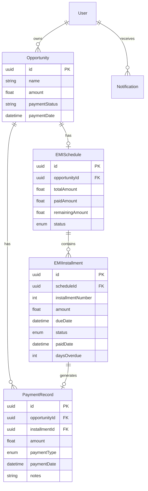
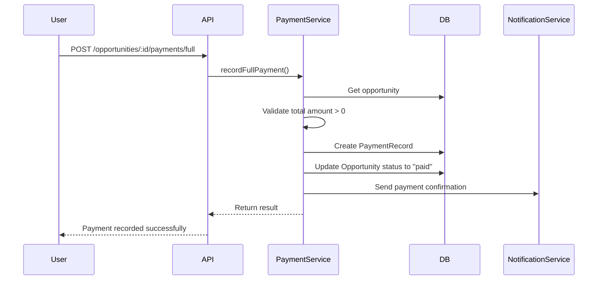
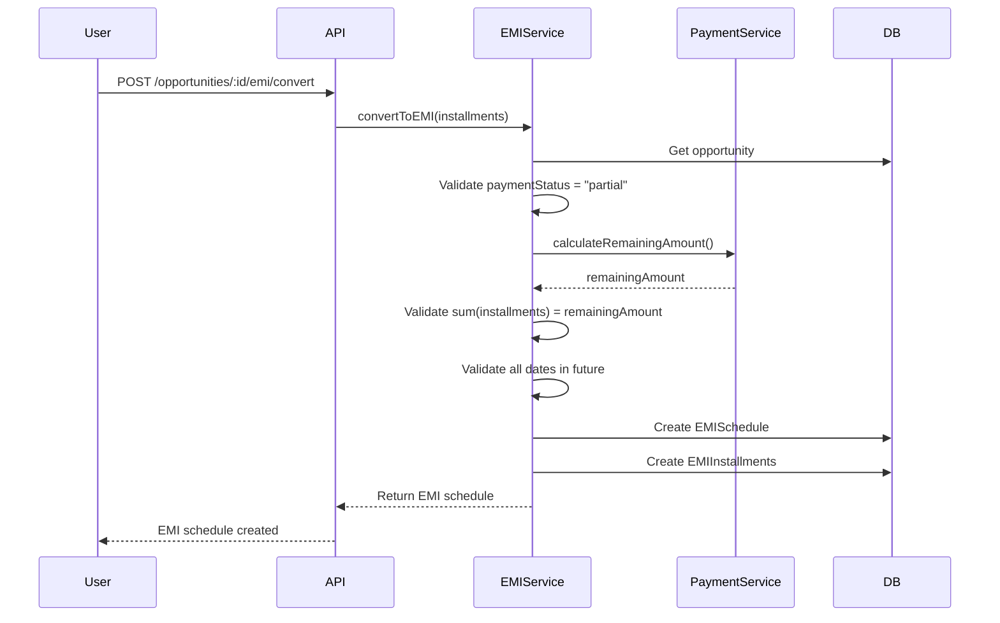
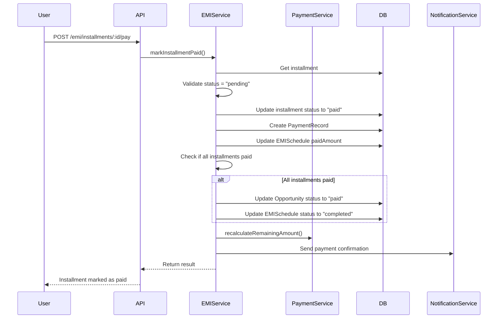
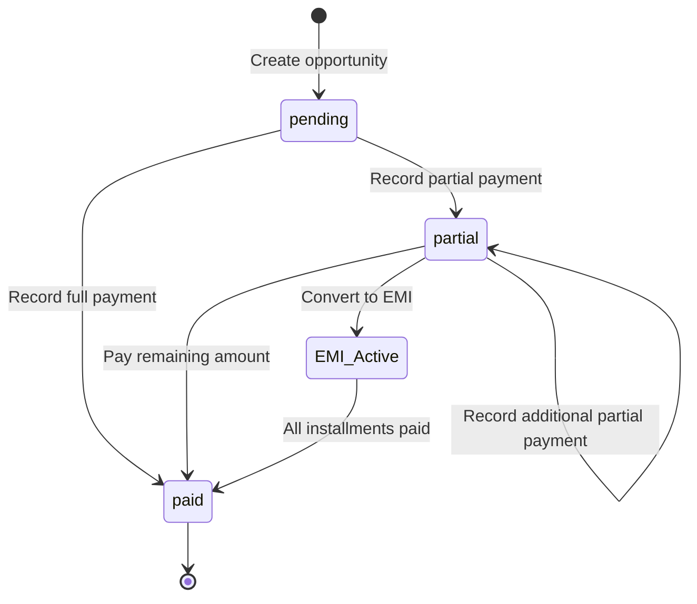
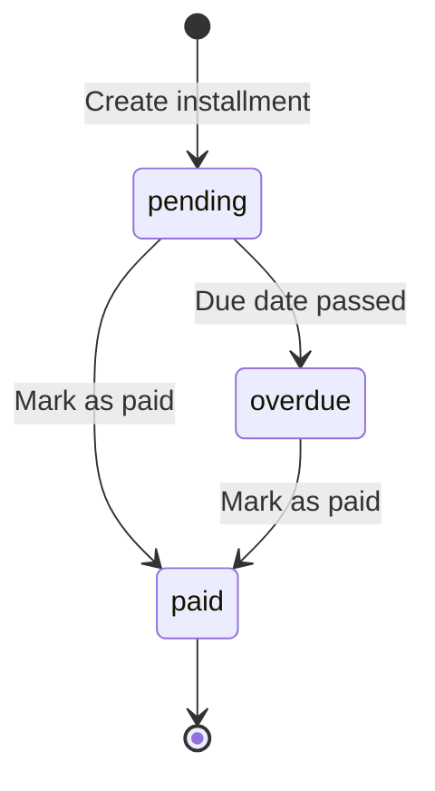

# Design Document: EMI Payment System

## Overview

The EMI Payment System extends the CRM's opportunity management capabilities by introducing flexible payment tracking and installment-based payment plans. This system allows users to record full payments, partial payments, and convert partial payments into structured EMI (Equated Monthly Installment) schedules with automated payment reminders.

### Key Capabilities

- Record full and partial payments for opportunities
- Convert partial payments into customizable EMI schedules
- Track individual installment payments with due dates
- Automated notifications for payment due dates and overdue installments
- Payment summary and history tracking
- Validation of payment amounts and schedule integrity

### Design Goals

1. **Data Integrity**: Ensure payment amounts are always consistent and accurate through invariant properties
2. **Flexibility**: Support both manual EMI schedule creation and future automatic generation
3. **User Experience**: Provide clear payment status visibility and intuitive payment management
4. **Extensibility**: Design for future enhancements like early payment discounts and late fees
5. **Reliability**: Implement robust validation and error handling for all payment operations

## Architecture

### High-Level Architecture

The EMI Payment System follows a layered architecture pattern consistent with the existing CRM codebase:

```
┌─────────────────────────────────────────────────────────────┐
│                     Frontend Layer (React)                   │
│  ┌──────────────────┐  ┌──────────────────┐                │
│  │ Payment Dialog   │  │ EMI Schedule     │                │
│  │ Components       │  │ Display          │                │
│  └──────────────────┘  └──────────────────┘                │
└─────────────────────────────────────────────────────────────┘
                            │
                            ▼
┌─────────────────────────────────────────────────────────────┐
│                      API Layer (Express)                     │
│  ┌──────────────────┐  ┌──────────────────┐                │
│  │ Payment Routes   │  │ EMI Routes       │                │
│  └──────────────────┘  └──────────────────┘                │
└─────────────────────────────────────────────────────────────┘
                            │
                            ▼
┌─────────────────────────────────────────────────────────────┐
│                   Service Layer (Business Logic)             │
│  ┌──────────────────┐  ┌──────────────────┐                │
│  │ Payment Service  │  │ EMI Service      │                │
│  │ - Validations    │  │ - Schedule Calc  │                │
│  │ - Amount Calc    │  │ - Status Updates │                │
│  └──────────────────┘  └──────────────────┘                │
│           │                      │                           │
│           └──────────┬───────────┘                           │
│                      ▼                                       │
│  ┌──────────────────────────────────────┐                   │
│  │   Notification Service               │                   │
│  │   - Payment Reminders                │                   │
│  │   - Overdue Alerts                   │                   │
│  └──────────────────────────────────────┘                   │
└─────────────────────────────────────────────────────────────┘
                            │
                            ▼
┌─────────────────────────────────────────────────────────────┐
│                  Data Layer (Prisma + PostgreSQL)            │
│  ┌──────────────┐  ┌──────────────┐  ┌──────────────┐     │
│  │ Opportunity  │  │ EMISchedule  │  │ PaymentRecord│     │
│  └──────────────┘  └──────────────┘  └──────────────┘     │
│         │                  │                  │             │
│         └──────────────────┴──────────────────┘             │
│                            │                                 │
│                  ┌──────────────────┐                       │
│                  │ EMIInstallment   │                       │
│                  └──────────────────┘                       │
└─────────────────────────────────────────────────────────────┘
```

### Component Responsibilities

**Frontend Components**:
- Payment status display and management UI
- EMI schedule creation and modification forms
- Payment history and summary views
- Installment payment marking interface

**API Controllers**:
- Request validation and authentication
- Route handling for payment operations
- Response formatting and error handling

**Service Layer**:
- Payment amount calculations and validations
- EMI schedule generation and management
- Payment status updates and state transitions
- Business rule enforcement

**Notification Service**:
- Daily check for due and overdue payments
- Notification generation and delivery
- Integration with existing notification system

**Data Layer**:
- Persistent storage of payment records
- EMI schedule and installment tracking
- Referential integrity enforcement
- Transaction support for atomic operations

## Components and Interfaces

### Database Models

#### EMISchedule Model

```prisma
model EMISchedule {
  id                String            @id @default(uuid())
  opportunityId     String            @unique
  totalAmount       Float             // Remaining amount at time of EMI creation
  paidAmount        Float             @default(0)
  remainingAmount   Float
  status            EMIStatus         @default(active)
  createdAt         DateTime          @default(now())
  updatedAt         DateTime          @updatedAt
  
  opportunity       Opportunity       @relation(fields: [opportunityId], references: [id], onDelete: Cascade)
  installments      EMIInstallment[]
  
  @@index([opportunityId])
  @@index([status])
}

enum EMIStatus {
  active
  completed
  cancelled
}
```

#### EMIInstallment Model

```prisma
model EMIInstallment {
  id              String            @id @default(uuid())
  scheduleId      String
  installmentNumber Int
  amount          Float
  dueDate         DateTime
  status          InstallmentStatus @default(pending)
  paidDate        DateTime?
  daysOverdue     Int               @default(0)
  createdAt       DateTime          @default(now())
  updatedAt       DateTime          @updatedAt
  
  schedule        EMISchedule       @relation(fields: [scheduleId], references: [id], onDelete: Cascade)
  paymentRecord   PaymentRecord?
  
  @@unique([scheduleId, installmentNumber])
  @@index([scheduleId])
  @@index([dueDate])
  @@index([status])
}

enum InstallmentStatus {
  pending
  overdue
  paid
}
```

#### PaymentRecord Model

```prisma
model PaymentRecord {
  id              String       @id @default(uuid())
  opportunityId   String
  amount          Float
  paymentType     PaymentType
  paymentDate     DateTime     @default(now())
  installmentId   String?      @unique
  notes           String?
  createdAt       DateTime     @default(now())
  updatedAt       DateTime     @updatedAt
  
  opportunity     Opportunity  @relation(fields: [opportunityId], references: [id], onDelete: Cascade)
  installment     EMIInstallment? @relation(fields: [installmentId], references: [id])
  
  @@index([opportunityId])
  @@index([paymentDate])
  @@index([paymentType])
}

enum PaymentType {
  full
  partial
  emi_installment
}
```

#### Opportunity Model Updates

```prisma
model Opportunity {
  // ... existing fields ...
  paymentStatus   String          @default("pending") // pending, partial, paid
  paymentDate     DateTime?
  
  // New relations
  emiSchedule     EMISchedule?
  paymentRecords  PaymentRecord[]
}
```

### API Endpoints

#### Payment Operations

**POST /api/opportunities/:id/payments/full**
- Mark opportunity as fully paid
- Request Body: `{ paymentDate?: Date, notes?: string }`
- Response: Updated opportunity with payment record

**POST /api/opportunities/:id/payments/partial**
- Record a partial payment
- Request Body: `{ amount: number, paymentDate?: Date, notes?: string }`
- Response: Updated opportunity with payment record

**GET /api/opportunities/:id/payments**
- Get all payment records for an opportunity
- Response: Array of payment records with summary

**GET /api/opportunities/:id/payment-summary**
- Get payment summary (total, paid, remaining)
- Response: Payment summary object

#### EMI Operations

**POST /api/opportunities/:id/emi/convert**
- Convert partial payment to EMI schedule
- Request Body: `{ installments: Array<{ dueDate: Date, amount: number }> }`
- Response: Created EMI schedule with installments

**GET /api/opportunities/:id/emi**
- Get EMI schedule for an opportunity
- Response: EMI schedule with all installments

**PUT /api/opportunities/:id/emi/installments/:installmentId**
- Update an installment (modify due date or amount)
- Request Body: `{ dueDate?: Date, amount?: number }`
- Response: Updated installment

**POST /api/opportunities/:id/emi/installments/:installmentId/pay**
- Mark an installment as paid
- Request Body: `{ paymentDate?: Date, notes?: string }`
- Response: Updated installment and payment record

**DELETE /api/opportunities/:id/emi/installments/:installmentId**
- Delete a pending installment
- Response: Success message

### Service Layer Interfaces

#### PaymentService

```typescript
interface PaymentService {
  // Record full payment
  recordFullPayment(
    opportunityId: string,
    paymentDate?: Date,
    notes?: string
  ): Promise<PaymentResult>;
  
  // Record partial payment
  recordPartialPayment(
    opportunityId: string,
    amount: number,
    paymentDate?: Date,
    notes?: string
  ): Promise<PaymentResult>;
  
  // Get payment summary
  getPaymentSummary(opportunityId: string): Promise<PaymentSummary>;
  
  // Validate payment amount
  validatePaymentAmount(
    opportunityId: string,
    amount: number
  ): Promise<ValidationResult>;
  
  // Calculate remaining amount
  calculateRemainingAmount(opportunityId: string): Promise<number>;
}

interface PaymentResult {
  success: boolean;
  opportunity: Opportunity;
  paymentRecord: PaymentRecord;
  message: string;
}

interface PaymentSummary {
  totalAmount: number;
  paidAmount: number;
  remainingAmount: number;
  paymentStatus: string;
  paymentRecords: PaymentRecord[];
  emiSchedule?: EMISchedule;
}
```

#### EMIService

```typescript
interface EMIService {
  // Convert to EMI
  convertToEMI(
    opportunityId: string,
    installments: InstallmentInput[]
  ): Promise<EMISchedule>;
  
  // Get EMI schedule
  getEMISchedule(opportunityId: string): Promise<EMISchedule | null>;
  
  // Update installment
  updateInstallment(
    installmentId: string,
    updates: InstallmentUpdate
  ): Promise<EMIInstallment>;
  
  // Mark installment as paid
  markInstallmentPaid(
    installmentId: string,
    paymentDate?: Date,
    notes?: string
  ): Promise<InstallmentPaymentResult>;
  
  // Delete installment
  deleteInstallment(installmentId: string): Promise<void>;
  
  // Validate EMI schedule
  validateEMISchedule(
    opportunityId: string,
    installments: InstallmentInput[]
  ): Promise<ValidationResult>;
  
  // Check and update overdue status
  updateOverdueStatus(): Promise<void>;
}

interface InstallmentInput {
  dueDate: Date;
  amount: number;
}

interface InstallmentUpdate {
  dueDate?: Date;
  amount?: number;
}

interface InstallmentPaymentResult {
  success: boolean;
  installment: EMIInstallment;
  paymentRecord: PaymentRecord;
  scheduleCompleted: boolean;
  message: string;
}
```

#### EMINotificationService

```typescript
interface EMINotificationService {
  // Check for due payments
  checkDuePayments(): Promise<void>;
  
  // Send payment reminder
  sendPaymentReminder(
    installment: EMIInstallment,
    opportunity: Opportunity
  ): Promise<void>;
  
  // Send overdue alert
  sendOverdueAlert(
    installment: EMIInstallment,
    opportunity: Opportunity
  ): Promise<void>;
}
```

## Data Models

### Entity Relationship Diagram



### Data Flow Diagrams

#### Full Payment Flow



#### EMI Conversion Flow



#### Installment Payment Flow



### State Transitions

#### Opportunity Payment Status



#### EMI Installment Status




## Correctness Properties

*A property is a characteristic or behavior that should hold true across all valid executions of a system—essentially, a formal statement about what the system should do. Properties serve as the bridge between human-readable specifications and machine-verifiable correctness guarantees.*

### Property Reflection

After analyzing all acceptance criteria, I identified the following redundancies and consolidations:

**Redundancies Eliminated:**
- Criteria 6.5 is redundant with 6.3 (both test that paid installments don't generate notifications)
- Criteria 9.5 is redundant with 9.1 (both test that paid installments cannot be modified)
- Multiple criteria test positive amount validation (1.4, 2.3, 4.4, 8.2) - consolidated into one property
- Multiple criteria test that payment dates are recorded (1.2, 5.2) - consolidated into one property
- Criteria about displaying data (7.1, 7.2, 10.1, 10.2, 10.3) are API response properties - consolidated

**Properties Combined:**
- Full payment state changes (1.1, 1.3, 1.5) combined into comprehensive full payment property
- Partial payment validations (2.2, 2.3, 8.1, 8.2) combined into payment amount validation property
- EMI schedule validation (4.2, 4.3, 4.4, 4.7, 9.3) combined into comprehensive schedule validation property
- Installment payment effects (5.1, 5.2, 5.3, 5.6) combined into installment payment property

### Property 1: Payment Amount Conservation (Invariant)

*For any* opportunity at any point in time, the equation `Total_Amount = Sum(all Payment_Record amounts) + Remaining_Amount` must hold true.

**Validates: Requirements 8.5, 10.6**

This is the fundamental invariant of the payment system. Money is neither created nor lost - every dollar is accounted for either as paid or remaining.

### Property 2: Full Payment Completeness

*For any* opportunity, when marked as fully paid, the system shall create a payment record with amount equal to the total amount, set paymentStatus to "paid", record the payment date, and prevent further payment modifications.

**Validates: Requirements 1.1, 1.2, 1.3, 1.5**

This property ensures that full payment is an atomic, complete operation that properly transitions the opportunity to a terminal paid state.

### Property 3: Partial Payment State Transition

*For any* opportunity with status "pending" or "partial", when a valid partial payment is recorded (0 < amount < remaining amount), the system shall set paymentStatus to "partial", create a payment record, and update the remaining amount to `previous_remaining - payment_amount`.

**Validates: Requirements 2.1, 2.4, 2.5, 2.6**

This property ensures partial payments correctly update state and maintain the payment conservation invariant.

### Property 4: Payment Amount Validation

*For any* payment operation, the system shall reject amounts that are not positive numbers or that exceed the remaining amount, ensuring that `0 < payment_amount <= remaining_amount`.

**Validates: Requirements 1.4, 2.2, 2.3, 8.1, 8.2, 8.4**

This property prevents invalid payment amounts from entering the system, maintaining data integrity.

### Property 5: EMI Conversion Preconditions

*For any* opportunity, EMI conversion shall succeed only when paymentStatus is "partial", remaining amount is greater than zero, and no EMI schedule already exists for that opportunity.

**Validates: Requirements 3.2, 3.3, 3.4**

This property ensures EMI conversion only happens in valid states, preventing duplicate or invalid EMI schedules.

### Property 6: EMI Schedule Completeness (Invariant)

*For any* EMI schedule, the sum of all installment amounts must equal the remaining amount at the time of EMI creation, and this relationship must be maintained after any modifications to installment amounts.

**Validates: Requirements 4.2, 9.3**

This critical invariant ensures that the installment plan covers exactly the remaining balance, no more and no less.

### Property 7: EMI Schedule Validation

*For any* EMI schedule creation or modification, the system shall validate that: (1) at least one installment exists, (2) all installment amounts are positive, (3) all due dates are in the future (at creation time), and (4) the sum of installment amounts equals the remaining amount.

**Validates: Requirements 4.1, 4.3, 4.4, 4.7, 9.2**

This comprehensive validation property ensures EMI schedules are well-formed and feasible.

### Property 8: Installment Creation Completeness

*For any* valid EMI schedule input with N date-amount pairs, the system shall create exactly N EMI installment records, each with status "pending", linked to the schedule, and containing the corresponding due date and amount.

**Validates: Requirements 4.5, 4.6, 3.5**

This property ensures all installments are created correctly and completely from the input specification.

### Property 9: Installment Payment Effects

*For any* pending or overdue installment, when marked as paid, the system shall: (1) update installment status to "paid", (2) record the payment date, (3) create a payment record with the installment amount, (4) decrease the schedule's remaining amount by the installment amount, and (5) if all installments are paid, update the opportunity status to "paid".

**Validates: Requirements 5.1, 5.2, 5.3, 5.4, 5.6, 12.4**

This comprehensive property ensures installment payments have all the correct side effects and maintain system invariants.

### Property 10: Installment Payment Idempotence

*For any* installment, marking it as paid when it is already paid shall either be rejected or have no additional effect on the system state (idempotent operation).

**Validates: Requirements 5.5**

This property ensures that duplicate payment operations don't corrupt the system state.

### Property 11: Installment Modification Constraints

*For any* installment modification or deletion operation, the system shall allow changes only to installments with status "pending", and shall maintain the EMI schedule completeness invariant (sum of amounts = remaining amount) and minimum size constraint (at least one installment remains).

**Validates: Requirements 9.1, 9.4**

This property ensures modifications maintain schedule integrity and prevent invalid states.

### Property 12: Overdue Status Detection

*For any* installment with status "pending", when the current date is after the due date, the system shall mark the installment as "overdue" and calculate days overdue as `current_date - due_date`.

**Validates: Requirements 12.1, 12.3**

This property ensures overdue installments are correctly identified and tracked.

### Property 13: Payment Notification Targeting

*For any* installment with status "pending" or "overdue" where the due date matches the current date, the notification service shall send exactly one notification per day to the opportunity owner, including opportunity name, customer name, installment amount, and due date.

**Validates: Requirements 6.1, 6.2, 6.3**

This property ensures payment reminders are sent to the right people at the right time with complete information.

### Property 14: Payment Summary Accuracy

*For any* opportunity, the payment summary shall return: (1) total amount from opportunity, (2) paid amount as sum of all payment records, (3) remaining amount as total minus paid, (4) all payment records, and (5) if EMI exists, the schedule with installment counts and next due date.

**Validates: Requirements 7.1, 7.2, 7.3, 7.4, 7.5, 10.1, 10.2, 10.3, 10.4, 10.5**

This property ensures the payment summary provides complete and accurate information for decision-making.

### Property 15: Data Persistence and Referential Integrity

*For any* created EMI schedule, installment, or payment record, the system shall persist it to the database with a unique identifier and maintain referential integrity such that: (1) installments link to their schedule, (2) payment records link to their opportunity and optionally to an installment, and (3) when an opportunity is deleted, all related EMI schedules, installments, and payment records are cascade deleted.

**Validates: Requirements 11.1, 11.2, 11.3, 11.4, 3.5**

This property ensures data is reliably stored and relationships are maintained correctly.

### Property 16: Non-Negative Amounts Invariant

*For all* payment-related amounts (total amount, remaining amount, installment amounts, payment amounts) at any point in time, the value shall be greater than or equal to zero.

**Validates: Requirements 8.4**

This invariant ensures the system never enters an invalid state with negative monetary values.

### Property 17: Multiple Partial Payments Accumulation

*For any* opportunity, the system shall accept multiple partial payment operations until the sum of all payments equals the total amount, at which point the opportunity status shall transition to "paid".

**Validates: Requirements 2.6**

This property ensures the system supports incremental payment workflows correctly.

## Error Handling

### Validation Errors

The system shall provide clear, actionable error messages for all validation failures:

**Payment Amount Errors:**
- `PAYMENT_AMOUNT_INVALID`: "Payment amount must be a positive number"
- `PAYMENT_EXCEEDS_REMAINING`: "Payment amount ($X) exceeds remaining balance ($Y)"
- `PAYMENT_AMOUNT_ZERO`: "Payment amount must be greater than zero"
- `TOTAL_AMOUNT_INVALID`: "Opportunity total amount must be greater than zero"

**Payment Status Errors:**
- `ALREADY_FULLY_PAID`: "Opportunity is already fully paid and cannot accept additional payments"
- `INVALID_STATUS_FOR_EMI`: "EMI conversion requires opportunity status to be 'partial', current status is '{status}'"
- `NO_REMAINING_BALANCE`: "Cannot convert to EMI with zero remaining balance"

**EMI Schedule Errors:**
- `EMI_ALREADY_EXISTS`: "An EMI schedule already exists for this opportunity"
- `EMI_SCHEDULE_EMPTY`: "EMI schedule must contain at least one installment"
- `INSTALLMENT_SUM_MISMATCH`: "Sum of installment amounts ($X) does not equal remaining amount ($Y)"
- `INSTALLMENT_AMOUNT_INVALID`: "All installment amounts must be positive numbers"
- `DUE_DATE_IN_PAST`: "Installment due date must be in the future"
- `MINIMUM_INSTALLMENTS_REQUIRED`: "EMI schedule must have at least one installment"

**Installment Modification Errors:**
- `INSTALLMENT_NOT_PENDING`: "Only pending installments can be modified, current status is '{status}'"
- `INSTALLMENT_ALREADY_PAID`: "Cannot modify or delete a paid installment"
- `CANNOT_DELETE_LAST_INSTALLMENT`: "Cannot delete the last installment in a schedule"
- `MODIFICATION_BREAKS_INVARIANT`: "Modification would cause sum of installments to not equal remaining amount"

**Data Integrity Errors:**
- `OPPORTUNITY_NOT_FOUND`: "Opportunity with ID {id} not found"
- `EMI_SCHEDULE_NOT_FOUND`: "EMI schedule not found for opportunity {id}"
- `INSTALLMENT_NOT_FOUND`: "Installment with ID {id} not found"
- `PAYMENT_RECORD_NOT_FOUND`: "Payment record with ID {id} not found"

### Error Response Format

All API errors shall follow a consistent format:

```typescript
interface ErrorResponse {
  success: false;
  error: {
    code: string;
    message: string;
    details?: any;
    field?: string;
  };
}
```

### Transaction Handling

All payment operations that modify multiple records shall be wrapped in database transactions to ensure atomicity:

- Full payment: Create payment record + update opportunity status
- Partial payment: Create payment record + update opportunity remaining amount
- EMI conversion: Create schedule + create all installments
- Installment payment: Update installment + create payment record + update schedule + conditionally update opportunity
- Installment modification: Update installment + validate schedule invariant
- Installment deletion: Delete installment + validate minimum size

If any step in a transaction fails, all changes shall be rolled back and an appropriate error returned.

### Retry Logic

For notification delivery failures, the system shall implement exponential backoff retry logic:

- Initial retry after 1 minute
- Second retry after 5 minutes
- Third retry after 15 minutes
- After 3 failed attempts, log error and alert system administrators

### Graceful Degradation

If the notification service is unavailable:
- Payment operations shall still succeed
- Notification failures shall be logged but not block payment processing
- A background job shall retry failed notifications

## Testing Strategy

### Dual Testing Approach

The EMI Payment System requires both unit tests and property-based tests for comprehensive coverage:

**Unit Tests** focus on:
- Specific examples of payment scenarios
- Edge cases (zero amounts, boundary conditions)
- Error conditions and validation failures
- Integration between components
- API endpoint behavior

**Property-Based Tests** focus on:
- Universal properties that hold for all inputs
- Invariant maintenance across operations
- Comprehensive input coverage through randomization
- State transition correctness

Together, these approaches provide complementary coverage: unit tests catch concrete bugs in specific scenarios, while property tests verify general correctness across the input space.

### Property-Based Testing Configuration

**Framework Selection:**
- Use `fast-check` for TypeScript/Node.js property-based testing
- Minimum 100 iterations per property test (due to randomization)
- Each property test must reference its design document property

**Test Tagging Format:**
```typescript
// Feature: emi-payment-system, Property 1: Payment Amount Conservation
test('payment amount conservation invariant', async () => {
  await fc.assert(
    fc.asyncProperty(/* generators */, async (/* inputs */) => {
      // Test implementation
    }),
    { numRuns: 100 }
  );
});
```

### Test Organization

```
server/src/tests/
├── unit/
│   ├── payment.test.ts           # Unit tests for payment operations
│   ├── emi.test.ts                # Unit tests for EMI operations
│   └── emi-notification.test.ts   # Unit tests for notifications
├── property/
│   ├── payment-properties.test.ts # Property tests for payment invariants
│   ├── emi-properties.test.ts     # Property tests for EMI invariants
│   └── generators.ts              # Custom generators for test data
└── integration/
    └── emi-workflow.test.ts       # End-to-end workflow tests
```

### Key Test Scenarios

**Unit Test Examples:**

1. **Full Payment Happy Path**
   - Create opportunity with products
   - Mark as fully paid
   - Verify status, payment record, and date

2. **Partial Payment Sequence**
   - Create opportunity with $1000 total
   - Pay $300, verify remaining = $700
   - Pay $400, verify remaining = $300
   - Pay $300, verify status = "paid"

3. **EMI Conversion**
   - Create opportunity, make partial payment
   - Convert to 3-month EMI
   - Verify schedule and installments created

4. **Overdue Detection**
   - Create installment with past due date
   - Run overdue check job
   - Verify status updated to "overdue"

5. **Validation Failures**
   - Attempt negative payment amount
   - Attempt payment exceeding remaining
   - Attempt EMI conversion on fully paid opportunity
   - Attempt to modify paid installment

**Property Test Examples:**

1. **Property 1: Payment Conservation**
   ```typescript
   // Generate random opportunity and payment sequence
   // Verify: total = sum(payments) + remaining at all times
   ```

2. **Property 6: EMI Schedule Completeness**
   ```typescript
   // Generate random remaining amount and installment list
   // Verify: sum(installments) = remaining amount
   ```

3. **Property 9: Installment Payment Effects**
   ```typescript
   // Generate random EMI schedule
   // Pay random installments
   // Verify: all side effects occur correctly
   ```

4. **Property 17: Multiple Partial Payments**
   ```typescript
   // Generate random sequence of partial payments
   // Verify: all accepted until total reached, then status = "paid"
   ```

### Test Data Generators

For property-based testing, implement custom generators:

```typescript
// Generate valid opportunity
const opportunityGen = fc.record({
  id: fc.uuid(),
  amount: fc.float({ min: 100, max: 100000 }),
  paymentStatus: fc.constantFrom('pending', 'partial', 'paid'),
  // ... other fields
});

// Generate valid installment list that sums to target
const installmentListGen = (targetAmount: number, count: number) => {
  // Generate list of positive amounts that sum to targetAmount
};

// Generate valid payment amount for opportunity
const validPaymentGen = (opportunity: Opportunity) => {
  return fc.float({ 
    min: 0.01, 
    max: opportunity.amount - sumOfPayments(opportunity) 
  });
};
```

### Integration Testing

Test complete workflows end-to-end:

1. **Full Payment Workflow**
   - API: POST full payment → GET opportunity → verify status

2. **EMI Workflow**
   - API: POST partial payment → POST EMI conversion → GET EMI schedule → POST installment payment → verify updates

3. **Notification Workflow**
   - Create installment with today's due date → trigger notification job → verify notification sent

### Performance Testing

- Test payment operations with large numbers of payment records (1000+)
- Test EMI schedules with many installments (100+)
- Test notification job with many due installments (1000+)
- Ensure all operations complete within acceptable time limits (< 1 second for single operations)

### Database Testing

- Verify cascade deletion works correctly
- Test transaction rollback on errors
- Verify referential integrity constraints
- Test concurrent payment operations (optimistic locking)

### Notification Testing

- Mock notification service for unit tests
- Test notification content includes all required fields
- Test notification filtering (only pending/overdue)
- Test notification deduplication (one per day per installment)

## Implementation Notes

### Phase 1: Core Payment Operations (Week 1)
- Database schema migration
- Payment service implementation
- Basic API endpoints for full/partial payments
- Unit tests for payment operations

### Phase 2: EMI Schedule Management (Week 2)
- EMI service implementation
- EMI conversion and schedule creation
- Installment modification endpoints
- Property tests for EMI invariants

### Phase 3: Installment Payments (Week 3)
- Installment payment logic
- Status updates and completion detection
- Payment summary calculations
- Integration tests

### Phase 4: Notifications (Week 4)
- Notification service integration
- Overdue detection cron job
- Notification content templates
- End-to-end testing

### Phase 5: Frontend Integration (Week 5)
- React components for payment UI
- EMI schedule display
- Payment history views
- User acceptance testing

### Future Enhancements

**Automatic EMI Generation:**
- Equal installment calculator
- Custom frequency options (weekly, bi-weekly, monthly)
- Grace period configuration

**Advanced Features:**
- Early payment discounts
- Late payment penalties
- Payment reminders before due date (3 days, 1 week)
- Bulk installment payment
- EMI schedule templates

**Reporting:**
- Payment collection reports
- Overdue payment dashboard
- Cash flow projections
- Payment trend analysis

**Multi-Channel Notifications:**
- Email notifications
- SMS reminders
- WhatsApp notifications
- In-app push notifications

### Security Considerations

- Validate user permissions for payment operations
- Audit log all payment transactions
- Encrypt sensitive payment data
- Rate limit payment API endpoints
- Implement CSRF protection for payment forms

### Performance Optimizations

- Index database columns used in queries (opportunityId, dueDate, status)
- Cache payment summaries for frequently accessed opportunities
- Batch notification processing
- Use database transactions efficiently
- Implement pagination for payment history

### Monitoring and Observability

- Log all payment operations with correlation IDs
- Track payment operation latency
- Monitor notification delivery success rate
- Alert on failed transactions
- Dashboard for payment system health

