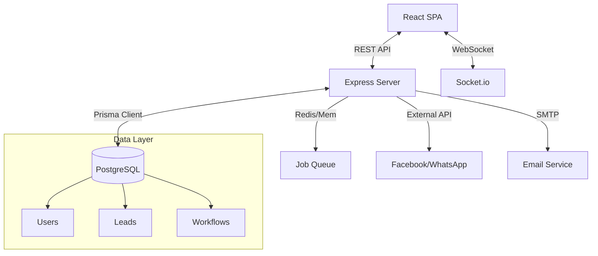

# CRM Architecture & Operations Guide

## 1. System Architecture

### 1.1 Technology Stack (PERN)
While often referred to as MERN, this CRM utilizes **PostgreSQL** for robust relational data management, accessed via **Prisma ORM**.

**Frontend (Client)**
- **Framework**: React 18 with Vite
- **Language**: TypeScript
- **UI System**: Shadcn UI + Tailwind CSS
- **State Management**: TanStack Query (Server State) + React Context (Auth/Socket)
- **Visualization**: Recharts, Leaflet (Maps)
- **Forms**: React Hook Form + Zod Schema Validation

**Backend (Server)**
- **Runtime**: Node.js
- **Framework**: Express.js
- **Database**: PostgreSQL (Managed via Prisma ORM)
- **Authentication**: JWT + Passport.js (Supports SSO/SAML)
- **Real-time**: Socket.io (Bi-directional communication)
- **Job Queue**: Node Cron (Scheduled tasks)

### 1.2 Data Architecture (Key Entities)
The database is structured around the **Organisation** tenant model.

-   **Core Entities**: `User`, `Team`, `Organisation`, `SubscriptionPlan`.
-   **Sales**: `Lead`, `Contact`, `Account`, `Opportunity`, `Quote`, `Product`.
-   **Activity**: `Task`, `Interaction` (Call/Email log), `CalendarEvent`, `CheckIn` (Geo).
-   **Marketing**: `Campaign` (Email), `SMSCampaign`, `WhatsAppCampaign`, `LandingPage`.
-   **Automation**: `Workflow`, `AssignmentRule` (Round-Robin), `WebForm`.

### 1.3 Architecture Diagram

---

## 2. Complete Operation Tutorial

### 2.1 onboarding & Setup
#### A. Organization Setup
1.  **General Settings**: Configure company details, logo, and time localization.
2.  **User Management**:
    -   Invite users via email.
    -   Assign Roles: **Admin** (Full Access), **Manager** (Team View), **Sales Rep** (Own Data), **Field Agent** (Mobile Access).
3.  **Teams**: Group users (e.g., "US Sales", "Field Ops") for reporting and assignment.

### 2.2 Sales Operations

#### A. Lead Lifecycle Management
The journey from potential interest to closed deal.
1.  **Capture**:
    -   **Web Forms**: Embed CRM forms on your website to auto-capture leads.
    -   **Import**: Upload CSV files via **Leads > Import**.
    -   **Manual**: Click **+ New Lead** for walk-ins/phone leads.
2.  **Qualification**:
    -   Use **Phone** icon to log calls (Outcome: "Interested", "Busy", etc.).
    -   Use **Email** icon to send templates.
    -   Update **Lead Status**: *New -> Attempted -> Contacted -> Qualified*.
3.  **Conversion**:
    -   Click **Convert** on a Qualified Lead.
    -   System generates:
        -   **Account**: The company entity.
        -   **Contact**: The individual.
        -   **Opportunity**: The potential revenue deal.

#### B. Pipeline & Opportunities
1.  **Kanban View**: Drag and drop opportunities across stages (Prospecting -> Negotiation -> Closed Won).
2.  **Forecasting**: Assign "Probability" and "Close Date" to estimate revenue in the **Reports > Forecast** module.

#### C. Field Force (Mobile App Usage)
Designed for agents on the move.
1.  **Check-In**:
    -   Agent arrives at client location.
    -   Open Mobile App > **Field Force** > **Check In**.
    -   GPS coordinates are logged.
2.  **Visit Logging**:
    -   Record notes, photos, or outcomes of the meeting.
3.  **Tracking**:
    -   Managers view real-time locations on the **Field Force Map**.

### 2.3 Marketing & Communication

#### A. Campaigns
1.  **Email/SMS/WhatsApp**:
    -   Navigate to **Marketing**.
    -   Create **Audience List** (filter Leads/Contacts).
    -   Design Template (Variables supported: `{{firstName}}`).
    -   Schedule blast.
2.  **Meta Integration**:
    -   Connect Facebook Page.
    -   Sync "Lead Ads" directly to CRM.

### 2.4 Automation Framework

#### A. Assignment Rules (Auto-Distribution)
Ensure leads never sit unassigned.
1.  Go to **Settings > Assignment Rules**.
2.  **Criteria**: e.g., `City` = `New York`.
3.  **Action**: Assign to `NY Team` via `Round Robin`.
4.  **Fallback**: If no match, assign to Admin.

#### B. Workflow Automation
Trigger actions based on events.
1.  **Trigger**: `Opportunity Stage` changes to `Negotiation`.
2.  **Action 1**: Create Task "Prepare Contract" for Rep.
3.  **Action 2**: Send Email "Contract details" to Manager.

### 2.5 Troubleshooting & Support
-   **Import Errors**: Ensure your CSV headers match CRM fields exactly.
-   **Email Delivery**: Verify SMTP settings if emails bounce.
-   **Geo-Location**: Ensure Location Services are enabled on the mobile browser for the Field Force module.
